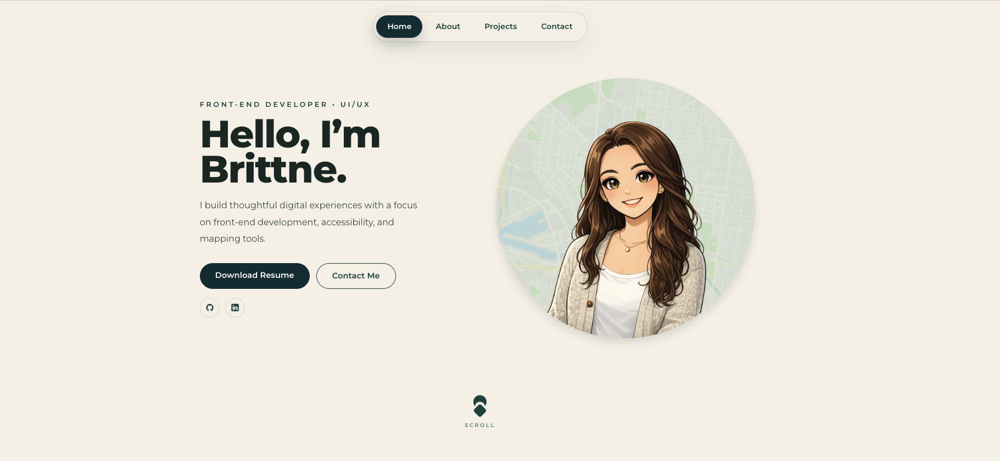

# Brittne Valdivia Portfolio
A customizable portfolio template for developers, designers, and career changers who want a clean way to showcase projects, skills, and case studies.

Use this template for your own portfolio. Please replace all personal content and keep credit in your README with a link back to this repository.

**Live Demo:** [brittnevaldivia.com](https://brittnevaldivia.com)

**License Notice:** The source code in this repository is licensed under MIT. Personal content such as portfolio copy, project case studies, resume files, branding, and images is not included in that license and should be replaced with your own before publishing.




A customizable portfolio built with Next.js and Tailwind CSS, with custom internal project pages for featured work. This repo is also structured to work as a reusable starter for other developers and designers building a portfolio site.

## Stack

- Next.js
- React
- Tailwind CSS
- TypeScript
- Vercel

## Getting Started

Install dependencies:

```bash
npm install
```

Start the development server:

```bash
npm run dev
```

Open [http://localhost:3000](http://localhost:3000) in your browser.

## Customize This Template

The easiest way to make this portfolio your own is to replace content in these places:

- `app/page.tsx` - homepage sections, hero copy, about section, contact section, and homepage project cards
- `app/projects/project-data.ts` - project titles, tags, summaries, and links
- `app/projects/[slug]/page.tsx` - individual project case study layouts and content
- `app/layout.tsx` - metadata, title, description, and share preview settings
- `public/` - personal images, icons, resume files, and project assets

Things most people will want to update right away:

- name and role
- GitHub and LinkedIn links
- email address and location
- project descriptions and screenshots
- resume file
- favicon and social preview image
- domain and metadata

## Project Structure

- `app/page.tsx` - homepage and one-page sections
- `app/projects/[slug]/page.tsx` - internal project detail pages
- `app/projects/project-data.ts` - project metadata
- `app/layout.tsx` - global metadata and app shell
- `public/` - images, icons, resume, and project assets

## Forking This Portfolio

You are welcome to fork this portfolio and use it as a starting point for your own.

Please note:

- The code in this repository is licensed under the MIT License.
- Personal content is not included in that license unless otherwise noted.
- Please replace all personal content with your own before publishing.
- Please keep credit to Brittne Valdivia in your README and link back to this repository.

Examples of personal content that should be replaced:

- portfolio copy and biography text
- project descriptions and case-study content
- resume files
- personal images, branding, icons, and graphics
- contact details and social links

## Recommended Credit

If you use this as a template, a short note like this is appreciated:

```md
Portfolio template adapted from Brittne Valdivia:
https://github.com/brittnebaila/techfolio
```

## Deployment

This project is set up to deploy easily on Vercel.

1. Push your fork to GitHub.
2. Import the repository into Vercel.
3. Update the content, assets, metadata, and domain settings for your own site.

## License

The source code is licensed under the [MIT License](./LICENSE).
